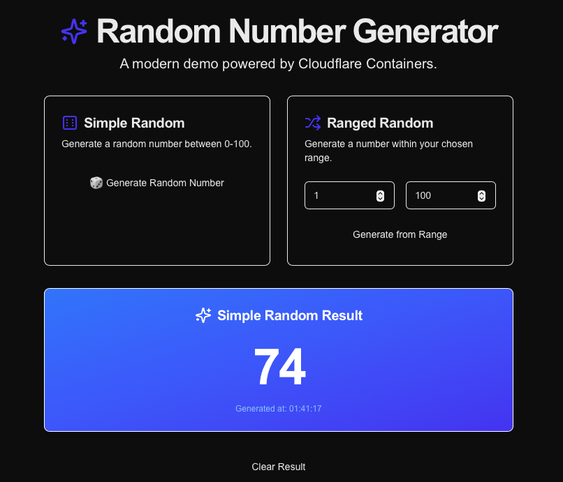
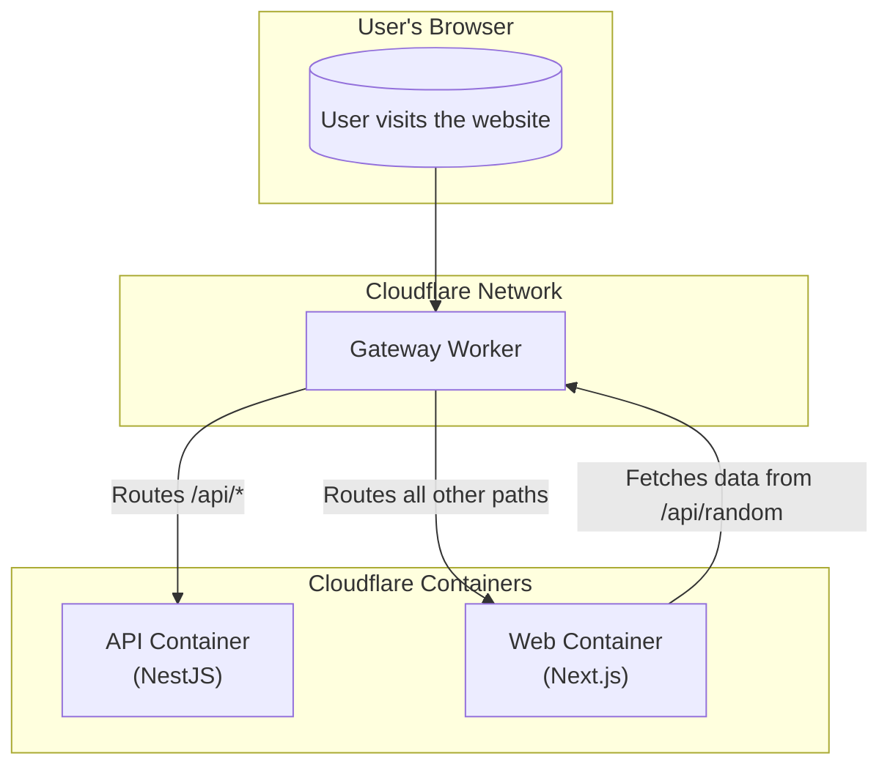

# NestJS + Next.js Random Number Generator on Cloudflare Container

This is an **experimental** monorepo for a Random Number Generator application built with NestJS for the backend API and Next.js for the frontend. The entire application is designed to showcase a deployment on [Cloudflare](https://www.cloudflare.com), utilizing **Cloudflare Workers** and **Cloudflare Containers** for a scalable and performant solution.

## 🚀 Live Demo & Preview

Experience the application live in your browser! This demo runs entirely on Cloudflare's global edge network, showcasing the power and speed of [Cloudflare Workers](https://workers.cloudflare.com/) and [Cloudflare Containers](https://developers.cloudflare.com/containers/).

🌐 **[Try the container](https://nest-next-random.moersoy-sites.workers.dev/)**


*A screenshot of the application's user interface.*

## 📝 Blog Post

For a deep dive into the project's architecture, challenges, and the development journey with Cloudflare Containers, check out the detailed blog post:

➡️ **[Pushing the Limits with Cloudflare Containers: A Gateway Architecture for NestJS and Next.js](https://www.linkedin.com/pulse/pushing-limits-cloudflare-containers-gateway-nestjs-nextjs-ersoy-hz5oe)**

## ✨ Features

-   **API (`/api`)**: A [NestJS](https://nestjs.com/) backend that provides a simple endpoint to get a random number within a specified range.
-   **Web (`/web`)**: A [Next.js](https://nextjs.org/) frontend with a user interface to set the range and display the random number.
-   **Cloudflare Native**: Optimized for deployment on the Cloudflare ecosystem.
-   **Dockerized**: Includes `Dockerfile`s for both the API and the web app for local development and containerized environments.
-   **Monorepo**: Managed with `pnpm` workspaces for easy dependency management and scripting.

## 🚀 Tech Stack

-   **Backend**: [NestJS](https://nestjs.com/), [TypeScript](https://www.typescriptlang.org/)
-   **Frontend**: [Next.js](https://nextjs.org/), [React](https://reactjs.org/), [Tailwind CSS](https://tailwindcss.com/)
-   **Deployment**: [Cloudflare Workers](https://workers.cloudflare.com/), [Cloudflare Containers](https://developers.cloudflare.com/containers/), [Wrangler CLI](https://developers.cloudflare.com/workers/wrangler/)
-   **Package Manager**: [pnpm](https://pnpm.io/)
-   **Containerization**: [Docker](https://www.docker.com/)

## 🏛️ Architecture

This project utilizes a multi-container architecture orchestrated by a Cloudflare Worker that acts as a gateway. All incoming traffic is first handled by the Worker, which then routes requests to the appropriate container based on the path.

-   **Cloudflare Worker (Gateway)**: The entry point (`src/index.ts`). It inspects the incoming request URL.
-   **API Service (`/api`)**: Requests starting with `/api` are proxied to the NestJS container, which handles backend logic.
-   **Web Service (`/web`)**: All other requests are sent to the Next.js container, which serves the React-based user interface.

This setup allows for a clean separation of concerns where the frontend and backend are independent services served under a single domain.

Here is a diagram illustrating the request flow:



## 📂 Project Structure

```
.
├── api/          # NestJS Backend API
├── web/          # Next.js Frontend
├── src/          # Cloudflare Worker entrypoint
├── Dockerfile.api
├── Dockerfile.web
├── docker-compose.yml
├── wrangler.jsonc # Wrangler configuration
├── package.json
└── pnpm-workspace.yaml
```

## ⚙️ Getting Started

### Prerequisites

-   [Node.js](https://nodejs.org/en/) (version specified in `.nvmrc`)
-   [pnpm](https://pnpm.io/installation)
-   [Docker](https://www.docker.com/get-started) (for running containers locally)
-   A [Cloudflare account](https://dash.cloudflare.com/sign-up)

### Installation

1.  **Clone the repository:**
    ```bash
    git clone https://github.com/moersoy/nest-next-cf-containers.git
    cd nest-next-cf-containers
    ```
    *Note: Remember to replace the URL with your actual repository URL.*

2.  **Install dependencies:**
    This command will install dependencies for the root, api, and web packages.
    ```bash
    pnpm install
    ```

## 🏃‍♂️ Running the Application

### Development

This command uses `wrangler` to start the Cloudflare Worker and, by extension, the API and Web containers locally. It simulates the Cloudflare environment.

```bash
pnpm dev
```

The frontend will be available at `http://localhost:8787` (or the port specified by Wrangler), and it will communicate with the API container.

### Using Docker Compose

To run the API and Web services as standalone containers without the Cloudflare Worker context:

1.  **Build the Docker images:**
    ```bash
    pnpm docker:build
    ```

2.  **Run with Docker Compose:**
    ```bash
    docker-compose up
    ```
    -   Next.js frontend will be available at `http://localhost:3000`
    -   NestJS API will be available at `http://localhost:8080`

## 📡 API Endpoints

The Gateway Worker provides several endpoints for monitoring and interacting with the service.

-   `GET /api/random?min=1&max=100`
    
    Generates a random number. You can provide `min` and `max` query parameters to specify a range.
    
    **Example Response:**
    ```json
    {
      "random": 27,
      "timestamp": "2025-06-25T23:16:22.000Z"
    }
    ```

-   `GET /health` & `GET /worker-info`
    
    These endpoints provide quick status and version information about the deployed Worker.

-   `GET /fetch-json`
    
    A demonstration endpoint that showcases the Worker's ability to fetch data from another, separate Worker using **Service Bindings**. This illustrates the powerful composition patterns possible on Cloudflare.

-   `GET /container-status`
    
    An experimental endpoint built for testing and observability. It checks the health of the API and Web containers and returns their status. This is useful for debugging and ensuring the containers are running as expected.

## 📦 Building for Production

This command builds the API and Web applications, preparing them for deployment.

```bash
pnpm build
```

## ☁️ Deployment

This project is configured for deployment to Cloudflare using the Wrangler CLI.

1.  **Login to Cloudflare:**
    ```bash
    pnpm wrangler login
    ```

2.  **Deploy the application:**
    You can deploy to different environments as configured in `wrangler.jsonc`.
    ```bash
    # Deploy to production environment
    pnpm deploy
    
    # Or specify an environment
    pnpm deploy:prod
    ```

## 📜 License

This project is licensed under the MIT License. See the [LICENSE](LICENSE) file for details. 
